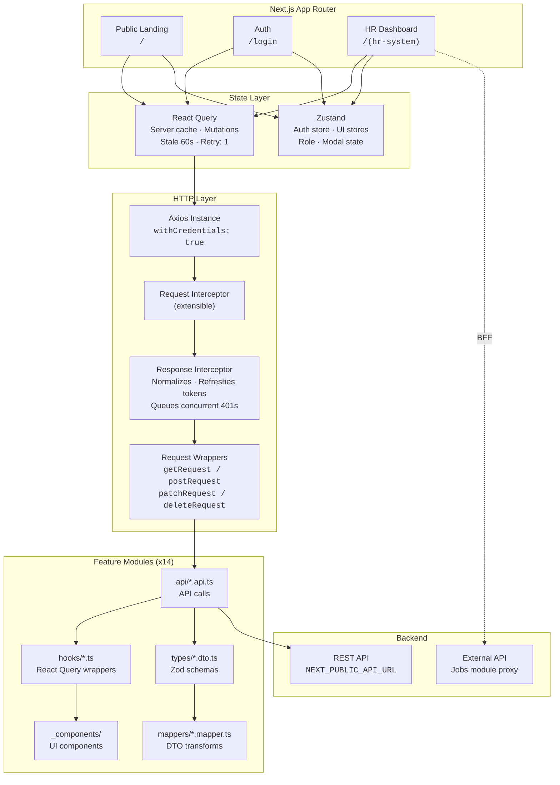

# Nezuko

End-to-end HR SaaS platform for workforce management — employee administration, attendance tracking, asset lifecycle, insurance plans, leave requests, project management, job recruitment, dynamic reporting, and an AI-powered assistant.

Built with Next.js 16, React 19, TypeScript 5, Tailwind CSS v4, and a custom Axios interceptor layer with automatic token refresh.

---

## Tech Stack

| Category | Technologies |
|----------|-------------|
| **Framework** | Next.js 16, React 19, TypeScript 5 |
| **Routing** | App Router (route groups, layouts, loading/error boundaries) |
| **Styling** | Tailwind CSS v4, clsx, tailwind-merge |
| **Client State** | Zustand 5 |
| **Server State** | TanStack React Query 5 |
| **HTTP Client** | Axios 1 (custom interceptors, token refresh queue, normalized responses) |
| **Forms** | React Hook Form 7 + Zod 4 validation |
| **Charts** | Recharts |
| **Animations** | Framer Motion 12 |
| **Icons** | Lucide React |
| **Notifications** | react-hot-toast |
| **i18n** | next-intl 4 (English + Arabic, 20 namespace files) |
| **Markdown** | react-markdown |
| **Carousel** | Swiper |
| **Linting** | ESLint 9 (flat config) |

---

## Architecture



### Key Design Decisions

- **Feature colocation** — each feature owns its API calls, hooks, components, DTOs, and mappers under a single directory
- **Axios interceptor chain** normalizes all responses into `{ data, error, status, all }`; on 401, queues concurrent requests while silently refreshing the token via POST `/auth/refresh`
- **Client state (Zustand)** for auth session and UI controls (open/close modals); **server state (React Query)** for all API data with 60s stale time, 1 retry
- **Cookie-based i18n** with `localePrefix: 'never'` — no URL prefix, locale switched via `NEXT_LOCALE` cookie, RTL direction toggled on `<html>`
- **Auth persistence** via localStorage (`role`, `isAuthenticated`); refresh tokens are httpOnly cookies handled transparently by the Axios interceptor
- **Jobs module** uses a BFF (Backend For Frontend) proxy — `src/app/api/jobs-proxy/` forwards requests to an external API at `nezuko0hr.alwaysdata.net` with its own auth cookie

---

## Authentication & Authorization

```
Login (3 fields) → POST /auth/login → localStorage { role, isAuthenticated } → Zustand store
```

| Layer | Mechanism |
|-------|-----------|
| **Login** | `companyEmail` + `userEmail` + `password` → POST `/auth/login` |
| **Session** | localStorage (`role`, `isAuthenticated`); httpOnly refresh cookie (auto-refresh via Axios interceptor) |
| **Route Guard** | `AuthGuard` wraps dashboard layout; redirects unauthenticated → `/login`; role-based routing (EMPLOYEE → `/profile`) |
| **Component Guard** | `RoleGuard` — conditional rendering via `allowedRoles` prop + optional `fallback` |
| **Roles** | `HR_ADMIN` · `MANAGER` · `EMPLOYEE` · `TENANT_OWNER` |

---

## Internationalization

| Aspect | Configuration |
|--------|---------------|
| **Locales** | English (`en`), Arabic (`ar`) |
| **Switching** | `NEXT_LOCALE` cookie, `localePrefix: 'never'` (clean URLs) |
| **Direction** | LTR (en) · RTL (ar) — toggled via `dir` attribute on `<html>` |
| **Messages** | 20 namespace files per locale: `common`, `landing`, `auth`, `dashboard`, `assets`, `leave`, `departments`, `employees`, `insurance`, `reports`, `timesheet`, `company`, `projects`, `jobs`, `chatbot`, `profile`, `bookDemo`, `pricing`, `services`, `blogs` |
| **Navigation** | `next-intl/navigation` — locale-aware `Link`, `useRouter`, `usePathname`, `redirect` |
| **Provider** | `NextIntlClientProvider` in root layout + `LocaleProvider` syncs `dir`/`lang` on `<html>` |

---

## Features

### Dashboard `/dashboard`
Executive overview with real-time KPIs and visual analytics.

| Metric cards | Charts | Widgets |
|-------------|--------|---------|
| Total employees, departments, projects, tasks | Pie (gender, project status) | Overdue tasks with progress |
| Pending leaves, attendance rate | Bar (task status) | Animated glowing orbs |
| | Radial bar (attendance) | Skeleton loading states |

**Roles:** `HR_ADMIN`, `MANAGER`, `TENANT_OWNER`

---

### Employees `/employees` · `/employees/[id]`
Full employee lifecycle management.

- **List** — sortable, searchable table with pagination
- **Create** — modal form with role and department assignment
- **View** — dedicated detail page with all employee data
- **Update / Delete** — inline actions with confirmation

**Roles:** `HR_ADMIN`, `MANAGER`, `TENANT_OWNER`

---

### Company `/company`
Tabbed settings page (info · general · attendance).

| Tab | Fields |
|-----|--------|
| **Company Info** | Name, industry, address, website, logo upload/delete |
| **General Settings** | Language preference, date format, fiscal year start month |
| **Attendance Settings** | Work day start/end, working days, late grace period (min), overtime threshold (hrs), geofence coordinates |

**Roles:** `HR_ADMIN`, `TENANT_OWNER`

---

### Profile `/profile`
Employee self-service profile.

- Personal info, job title, employee code
- Role badge and status indicator
- Emergency contact details
- Department and hire date

**Roles:** `EMPLOYEE`, `HR_ADMIN`, `MANAGER`

---

### Jobs `/jobs` · `/jobs/create` · `/jobs/[id]`
External recruitment board with bilingual postings.

- **BFF Proxy** — Next.js API route (`/api/jobs-proxy/`) forwards to external API (`nezuko0hr.alwaysdata.net`)
- **Separate auth** — httpOnly `jobs_token` cookie, `/check-auth` endpoint
- **Bilingual content** — each job has English and Arabic content
- **CRUD** — create, edit, list/search/filter, activate/deactivate
- **Job spec** — title, description, requirements, location, salary range, type, category

**Roles:** `HR_ADMIN`

---

### Assets `/asset` · `/asset/[id]` · `/asset/me` · `/asset/report`
Complete asset lifecycle tracking.

| Capability | Details |
|------------|---------|
| **Register** | Create asset with status (AVAILABLE, ASSIGNED, MAINTENANCE, RETIRED), category, purchase info |
| **Assign** | Assign to employee with custody record |
| **Transfer / Return** | Move between employees, record returns with dates |
| **My Assets** | View assets assigned to current user (`/asset/me`) |
| **Employee Assets** | View assets by employee (`/asset/employee/[id]`) |
| **Depreciation Report** | Calculated percentage-based depreciation over time |
| **History** | Full custody trail per asset |

**Roles:** `HR_ADMIN` · `MANAGER` (view own + team) · `EMPLOYEE` (view own)

---

### Insurance `/insurance` · `/insurance/[id]/enroll` · `/insurance/enrollments/me` · `/insurance/coverage-report`
Multi-tier insurance plan management.

| Feature | Details |
|---------|---------|
| **Plans** | BASIC / STANDARD / PREMIUM — define coverage, monthly cost, max dependents |
| **Enrollment** | Enroll employees with dependent selection (spouse, child, parent) |
| **Cost Preview** | See estimated cost before confirming enrollment |
| **Coverage Report** | Overview of all enrollments and plan distribution |
| **My Insurance** | View personal enrollments and dependents |

**Roles:** `HR_ADMIN` (manage) · `EMPLOYEE` (view own)

---

### Leave `/leave`
Employee leave request workflow.

| Action | Details |
|--------|---------|
| **Submit** | Leave request with date range, type, reason |
| **Approve / Reject** | Manager or HR reviews pending requests |
| **Cancel** | Employee can cancel their own pending requests |
| **Filter** | By status (PENDING / APPROVED / REJECTED / CANCELLED) |
| **View** | HR sees all; employee sees own |

**Roles:** `HR_ADMIN` · `MANAGER` (approve/reject) · `EMPLOYEE` (submit)

---

### Attendance `/attendance` · `/attendance/me`
GPS-based check-in / check-out.

- **Check-in/out** — records timestamp with latitude/longitude
- **Geofence** — validates location is within company perimeter
- **Error handling** — outside fence, permissions denied, duplicate records, feature disabled
- **My Attendance** — personal history with daily breakdown
- **Admin view** — all employee timesheets with date filters

**Roles:** `EMPLOYEE` (check-in/out) · `HR_ADMIN`, `MANAGER` (view all)

---

### Timesheets `/timesheets` · `/timesheets/me` · `/timesheets/submit` · `/timesheets/report/overtime`
Detailed time tracking with approval workflow.

| Capability | Details |
|------------|---------|
| **Submit** | Multiple entries per day with project/task/hours |
| **Edit** | Modify pending timesheets |
| **Approve / Reject** | Manager review with status badge |
| **My Timesheets** | Personal submission history |
| **Overtime Report** | Date range + department filters, exportable |
| **HR Submission** | HR can submit timesheets for multiple employees |

**Roles:** `HR_ADMIN` (submit/manage) · `MANAGER` (approve/reject) · `EMPLOYEE` (view own)

---

### Projects `/projects` · `/projects/[id]`
Project and task management.

| Project | Task |
|---------|------|
| Status: PLANNING, ACTIVE, ON_HOLD, COMPLETED, CANCELLED | Status: TODO, IN_PROGRESS, IN_REVIEW, DONE, BLOCKED |
| Progress tracking with percentage | Priority: LOW, MEDIUM, HIGH, URGENT |
| Create, update, cancel | Subtask support |
| | My Tasks page |
| | Overdue report grouped by project |

**Roles:** `HR_ADMIN` · `MANAGER` · `EMPLOYEE` (assignee)

---

### Reports `/reports` · `/reports/[type]` · `/reports/history`
Dynamic report generation engine.

- **5 types**: headcount, leave summary, overtime, asset custody, task completion
- **Filter bar** — dynamic filter fields based on report type
- **Preview** — paginated table with data from API
- **Export** — download as CSV or PDF
- **History** — previously generated reports with re-download

**Roles:** `HR_ADMIN`, `MANAGER`

---

### Departments `/departments` · `/departments/[id]`
Hierarchical department management.

- **Tree structure** — parent/child nesting with recursive children
- **CRUD** — create, update, delete departments
- **Manager assignment** — assign department head
- **Search / Filter** — by name, parent department

**Roles:** `HR_ADMIN`, `MANAGER`

---

### Chatbot `/chatbot`
AI-powered HR assistant.

- Conversational interface with message bubbles
- Markdown rendering for rich responses
- Quick actions: general help, contact HR
- Typing indicator and persistent session
- Configurable model backend

**Roles:** `EMPLOYEE`, `HR_ADMIN`, `MANAGER`

---

## Patterns & Conventions

Every feature follows a consistent file structure:

```
feature/
├── api/feature.api.ts      # API calls (axios wrappers + throwIfError)
├── hooks/useFeature.ts     # React Query hooks (useQuery / useMutation)
├── types/feature.dto.ts    # Zod validation schemas
├── mappers/feature.mapper.ts # DTO → frontend model transforms
└── _components/             # UI components (prefixed with _)
```

### API Layer

```
axios instance (withCredentials, baseURL from env)
  → request interceptor (extensible)
  → response interceptor (normalize { data, error, status }, 401 refresh queue)
  → request wrappers (getRequest, postRequest, putRequest, patchRequest, deleteRequest, uploadRequest)
  → throwIfError (converts error response → thrown error)
```

### Mutation Pattern

```typescript
export function useUpdateFeature() {
  const toast = useToast();
  const queryClient = useQueryClient();

  return useMutation({
    mutationFn: (data) => updateFeature(data),
    onSuccess: () => {
      queryClient.invalidateQueries({ queryKey: ["feature"] });
      toast.success("Updated successfully");
    },
    onError: (error) => {
      toast.error(error?.message || "Failed to update");
    },
  });
}
```

### State Stores (Zustand)

| Store | Purpose |
|-------|---------|
| `useAuthStore` | Role, auth hydration |
| `useAssetUIStore` | Modal type, selected asset |
| `useInsuranceUIStore` | Drawer/modal type, selected plan/dependent |
| `useDepartmentUIStore` | Modal type, selected department |

---

## Project Structure

```
src/
├── app/
│   ├── layout.tsx                     # Root layout (providers, i18n, fonts)
│   ├── page.tsx                       # Public landing page
│   ├── globals.css                    # Tailwind v4 theme tokens
│   │
│   ├── (auth)/login/                  # Authentication
│   │   ├── api/auth.api.ts
│   │   ├── hooks/useLogin.ts
│   │   └── components/LoginForm.tsx
│   │
│   ├── (hr-system)/                   # Dashboard (AuthGuard-protected)
│   │   ├── layout.tsx                 # Sidebar + Navbar + AuthGuard
│   │   ├── loading.tsx / error.tsx
│   │   ├── _components/              # AuthGuard, Sidebar, Navbar, DashboardHero
│   │   ├── dashboard/                # KPIs, charts, insights
│   │   ├── employees/                # Full employee CRUD
│   │   ├── company/                  # Info, general, attendance settings
│   │   ├── profile/                  # Self-profile view
│   │   ├── jobs/                     # External job board (BFF proxy)
│   │   ├── asset/                    # Asset lifecycle management
│   │   ├── insurance/                # Plans, enrollment, dependents
│   │   ├── leave/                    # Leave requests
│   │   ├── attendance/               # GPS check-in/out
│   │   ├── timesheets/               # Time tracking & overtime
│   │   ├── projects/                 # Projects & tasks
│   │   ├── reports/                  # Dynamic report generator
│   │   ├── departments/              # Department hierarchy
│   │   └── chatbot/                  # AI HR assistant
│   │
│   └── api/jobs-proxy/               # BFF proxy for external jobs API
│
├── components/
│   ├── ui/                           # Button, Input, Toast, Toggle, SelectWithSearch
│   │   └── data-states.tsx           # Skeleton, ErrorState, EmptyState, Spinner
│   ├── providers/Providers.tsx       # QueryClient + Toast
│   ├── RoleGuard/RoleGuard.tsx       # Role-based conditional render
│   └── i18n/                         # LanguageSwitcher, LocaleProvider
│
├── hooks/
│   ├── useAuthStore.ts               # Zustand auth store
│   ├── use-employee.ts               # Global employee hook
│   └── use-translation.ts            # Wrapped useTranslations
│
├── i18n/
│   ├── request.ts                    # Message loader (20 namespaces)
│   ├── routing.ts                    # defineRouting (en/ar, no prefix)
│   └── navigation.ts                 # createNavigation exports
│
├── lib/
│   ├── axios/
│   │   ├── core/
│   │   │   ├── instance.ts           # Axios instance with baseURL + interceptors
│   │   │   └── interceptors/
│   │   │       ├── request.interceptor.ts
│   │   │       └── response.interceptor.ts  # 401 refresh queue
│   │   ├── types/axios.types.ts
│   │   └── dist/
│   │       ├── requests.ts           # get/post/put/patch/delete/upload wrappers
│   │       └── wrapper.ts            # apiWrapper error normalizer
│   ├── api/
│   │   ├── config.ts                 # Endpoint URL map
│   │   ├── utils.ts                  # throwIfError, extractList
│   │   ├── jobsClient.ts             # Axios instance for jobs proxy
│   │   └── endpoints/                # Feature API files
│   └── mappers/                      # Global DTO mappers
│
├── types/
│   ├── globals.d.ts
│   └── dto/                          # Shared Zod schemas (user, asset, department, insurance, report)
│
└── proxy.ts                          # Middleware for locale cookie
```

---

## Environment Variables

| Variable | Default | Description |
|----------|---------|-------------|
| `NEXT_PUBLIC_API_URL` | `http://localhost:5000/api/v1` | Backend REST API base URL |

---

## Getting Started

### Prerequisites

- **Node.js** 18+ (LTS recommended)
- **npm** or **pnpm**

### Setup

```bash
# Clone
git clone <repository-url>
cd nezuko

# Install
npm install

# Environment (create .env)
echo "NEXT_PUBLIC_API_URL=http://localhost:5000/api/v1" > .env

# Start dev server
npm run dev
```

Open [http://localhost:3000](http://localhost:3000) in your browser.

---

## Available Scripts

| Command | Description |
|---------|-------------|
| `npm run dev` | Start development server (Turbopack) |
| `npm run build` | Production build |
| `npm start` | Start production server |
| `npm run lint` | Run ESLint |

---

## License

[MIT](LICENSE)
